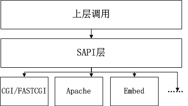
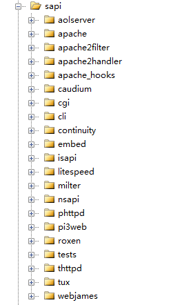

# 第二节 SAPI概述

前一小节介绍了PHP的生命周期，在其生命周期的各个阶段，一些与服务相关的操作都是通过SAPI接口实现。
这些内置实现的物理位置在PHP源码的SAPI目录。这个目录存放了PHP对各个服务器抽象层的代码，
例如命令行程序的实现，Apache的mod_php模块实现以及fastcgi的实现等等。

在各个服务器抽象层之间遵守着相同的约定，这里我们称之为SAPI接口。
每个SAPI实现都是一个_sapi_module_struct结构体变量。（SAPI接口）。
在PHP的源码中，当需要调用服务器相关信息时，全部通过SAPI接口中对应方法调用实现，
而这对应的方法在各个服务器抽象层实现时都会有各自的实现。

>**NOTE**
>由于很多操作的通用性，有很大一部分的接口方法使用的是默认方法。

如图2.4所示，为SAPI的简单示意图。

以cgi模式和apache2服务器为例，它们的启动方法如下：

    [c]
    cgi_sapi_module.startup(&cgi_sapi_module)   //  cgi模式 cgi/cgi_main.c文件

    apache2_sapi_module.startup(&apache2_sapi_module);
     //  apache2服务器  apache2handler/sapi_apache2.c文件

这里的cgi_sapi_module是sapi_module_struct结构体的静态变量。
它的startup方法指向php_cgi_startup函数指针。在这个结构体中除了startup函数指针，还有许多其它方法或字段。
其部分定义如下：

    [c]
    struct _sapi_module_struct {
        char *name;         //  名字（标识用）
        char *pretty_name;  //  更好理解的名字（自己翻译的）

        int (*startup)(struct _sapi_module_struct *sapi_module);    //  启动函数
        int (*shutdown)(struct _sapi_module_struct *sapi_module);   //  关闭方法

        int (*activate)(TSRMLS_D);  // 激活
        int (*deactivate)(TSRMLS_D);    //  停用

        int (*ub_write)(const char *str, unsigned int str_length TSRMLS_DC);
         //  不缓存的写操作(unbuffered write)
        void (*flush)(void *server_context);    //  flush
        struct stat *(*get_stat)(TSRMLS_D);     //  get uid
        char *(*getenv)(char *name, size_t name_len TSRMLS_DC); //  getenv

        void (*sapi_error)(int type, const char *error_msg, ...);   /* error handler */

        int (*header_handler)(sapi_header_struct *sapi_header, sapi_header_op_enum op,
            sapi_headers_struct *sapi_headers TSRMLS_DC);   /* header handler */

         /* send headers handler */
        int (*send_headers)(sapi_headers_struct *sapi_headers TSRMLS_DC);

        void (*send_header)(sapi_header_struct *sapi_header,
                void *server_context TSRMLS_DC);   /* send header handler */

        int (*read_post)(char *buffer, uint count_bytes TSRMLS_DC); /* read POST data */
        char *(*read_cookies)(TSRMLS_D);    /* read Cookies */

        /* register server variables */
        void (*register_server_variables)(zval *track_vars_array TSRMLS_DC);

        void (*log_message)(char *message);     /* Log message */
        time_t (*get_request_time)(TSRMLS_D);   /* Request Time */
        void (*terminate_process)(TSRMLS_D);    /* Child Terminate */

        char *php_ini_path_override;    //  覆盖的ini路径

        ...
        ...
    };

其中一些函数指针的说明如下：

* startup 当SAPI初始化时，首先会调用该函数。如果服务器处理多个请求时，该函数只会调用一次。
比如Apache的SAPI，它是以mod_php5的Apache模块的形式加载到Apache中的，
在这个SAPI中，startup函数只在父进程中创建一次，在其fork的子进程中不会调用。
* activate 此函数会在每个请求开始时调用，它会再次初始化每个请求前的数据结构。
* deactivate 此函数会在每个请求结束时调用，它用来确保所有的数据都，以及释放在activate中初始化的数据结构。
* shutdown 关闭函数，它用来释放所有的SAPI的数据结构、内存等。
* ub_write 不缓存的写操作(unbuffered write)，它是用来将PHP的数据输出给客户端，
如在CLI模式下，其最终是调用fwrite实现向标准输出输出内容；在Apache模块中，它最终是调用Apache提供的方法rwrite。
* sapi_error 报告错误用，大多数的SAPI都是使用的PHP的默认实现php_error。
* flush 刷新输出，在CLI模式下通过使用C语言的库函数fflush实现，在php_mode5模式下，使用Apache的提供的函数函数rflush实现。
* read_cookie 在SAPI激活时，程序会调用此函数，并且将此函数获取的值赋值给SG(request_info).cookie_data。
在CLI模式下，此函数会返回NULL。
* read_post 此函数和read_cookie一样也是在SAPI激活时调用，它与请求的方法相关，当请求的方法是POST时，程序会操作$_POST、$HTTP_RAW_POST_DATA等变量。
* send_header 发送头部信息，此方法一般的SAPI都会定制，其所不同的是，有些的会调服务器自带的（如Apache），有些的需要你自己实现（如 FastCGI）。

以上的这些结构在各服务器的接口实现中都有定义。如Apache2的定义：

    [c]
    static sapi_module_struct apache2_sapi_module = {
        "apache2handler",
        "Apache 2.0 Handler",

        php_apache2_startup,				/* startup */
        php_module_shutdown_wrapper,			/* shutdown */

        ...
    }

在PHP的源码中实现了很多的实现，比如IIS的实现以及一些非主流的Web服务器实现，其文件结构如图2.5所示：

>**NOTE**
>目前PHP内置的很多SAPI实现都已不再维护或者变的有些非主流了，PHP社区目前正在考虑将一些SAPI移出代码库。
>社区对很多功能的考虑是除非真的非常必要，或者某些功能已近非常通用了，否则就在PECL库中，
>例如非常流行的APC缓存扩展将进入核心代码库中。

整个SAPI类似于一个面向对象中的模板方法模式的应用。
SAPI.c和SAPI.h文件所包含的一些函数就是模板方法模式中的抽象模板，
各个服务器对于sapi_module的定义及相关实现则是一个个具体的模板。

这样的结构在PHP的源码中有多处使用，
比如在PHP扩展开发中，每个扩展都需要定义一个zend_module_entry结构体。
这个结构体的作用与sapi_module_struct结构体类似，都是一个类似模板方法模式的应用。
在PHP的生命周期中如果需要调用某个扩展，其调用的方法都是zend_module_entry结构体中指定的方法，
如在上一小节中提到的在执行各个扩展的请求初始化时，都是统一调用request_startup_func方法，
而在每个扩展的定义时，都通过宏PHP_RINIT指定request_startup_func对应的函数。
以VLD扩展为例：其请求初始化为PHP_RINIT(vld),与之对应在扩展中需要有这个函数的实现：

    [c]
    PHP_RINIT_FUNCTION(vld) {
    }

所以， 我们在写扩展时也需要实现扩展的这些接口，同样，当实现各服务器接口时也需要实现其对应的SAPI。
