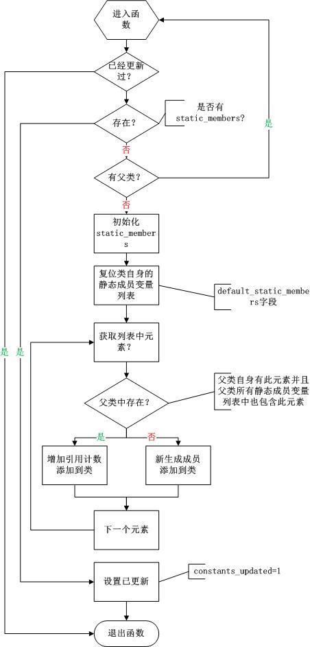
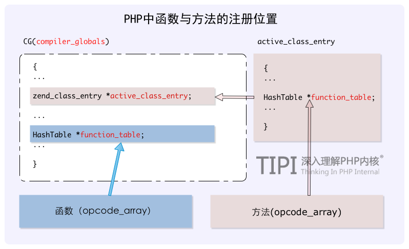

# 第二节 类的成员变量及方法

在上一小节，我们介绍了类的结构和声明过程，从而，我们知道了类的存储结构，接口抽象类等类型的实现方式。
在本小节，我们将介绍类的成员变量和成员方法。首先，我们看一下，什么是成员变量，什么是成员方法。

类的成员变量在PHP中本质上是一个变量，只是这些变量都归属于某个类，并且给这些变量是有访问控制的。
类的成员变量也称为成员属性，它是现实世界实体属性的抽象，是可以用来描述对象状态的数据。

类的成员方法在PHP中本质上是一个函数，只是这个函数以类的方法存在，它可能是一个类方法也可能是一个实例方法，
并且在这些方法上都加上了类的访问控制。类的成员方法是现实世界实体行为的抽象，可以用来实现类的行为。

## 成员变量
在第三章介绍过变量，不过那些变量要么是定义在全局范围中，叫做全局变量，要么是定义在某个函数中，
叫做局部变量。
成员变量是定义在类里面，并和成员方法处于同一层次。如下一个简单的PHP代码示例，定义了一个类，
并且这个类有一个成员变量。

    [php]
    class Tipi {
        public $var;
    }

类的结构在PHP内核中的存储方式我们已经在上一小节介绍过了。现在，我们要讨论类的成员变量的存储方式。
假如我们需要直接访问这个变量，整个访问过程是什么？
当然，以这个示例来说，访问这个成员变量是通过对象来访问，关于对象的相关知识我们将在后面的小节作详细的介绍。

当我们用VLD扩展查看以上代码生成的中间代码时，我们发现，并没有相关的中间代码输出。
这是因为成员变量在编译时已经注册到了类的结构中，那注册的过程是什么? 成员变量注册的位置在哪？

我们从上一小节知道，在编译时类的声明编译会调用zend_do_begin_class_declaration函数。
此函数用来初始化类的基本信息，其中包括类的成员变量。其调用顺序为：
[zend_do_begin_class_declaration] --> [zend_initialize_class_data] --> [zend_hash_init_ex]

    [c]
    zend_hash_init_ex(&ce->default_properties, 0, NULL, zval_ptr_dtor_func, persistent_hashes, 0);

因为类的成员变量是保存在HashTable中，所以，其数据的初始化使用zend_hash_init_ex函数来进行。

在声明类的时候初始化了类的成员变量所在的HashTable，之后如果有新的成员变量声明时，在编译时
**zend_do_declare_property**。函数首先检查成员变量不允许的一些情况：

* 接口中不允许使用成员变量
* 成员变量不能拥有抽象属性
* 不能声明成员变量为final
* 不能重复声明属性

如果在上面的PHP代码中的类定义中，给成员变量前面添加final关键字：

    [php]
    class Tipi {
        public final $var;
    }

运行程序将报错：Fatal error: Cannot declare property Tipi::$var final, 
the final modifier is allowed only for methods and classes in .. 
这个错误由zend_do_declare_property函数抛出：

    [c]
    if (access_type & ZEND_ACC_FINAL) {
		zend_error(E_COMPILE_ERROR, "Cannot declare property %s::$%s final, the final modifier is allowed only for methods and classes",
				   CG(active_class_entry)->name, var_name->u.constant.value.str.val);
	}

在定义检查没有问题之后，函数会进行成员变量的初始化操作。

    [c]
    ALLOC_ZVAL(property);   //  分配内存

	if (value) {    //  成员变量有初始化数据
		*property = value->u.constant;
	} else {
		INIT_PZVAL(property);
		Z_TYPE_P(property) = IS_NULL;
	}

在初始化过程中，程序会先分配内存，如果这个成员变量有初始化的数据，则将数据直接赋值给该属性，
否则初始化ZVAL，并将其类型设置为IS_NULL。在初始化过程完成后，程序通过调用 **zend_declare_property_ex**
函数将此成员变量添加到指定的类结构中。

以上为成员变量的初始化和注册成员变量的过程，常规的成员变量最后都会注册到类的 **default_properties** 字段。
在我们平时的工作中，可能会用不到上面所说的这些过程，但是我们可能会使用get_class_vars()函数来查看类的成员变量。
此函数返回由类的默认属性组成的关联数组，这个数组的元素以 varname => value 的形式存在。其实现核心代码如下：

    [c]
	if (zend_lookup_class(class_name, class_name_len, &pce TSRMLS_CC) == FAILURE) {
		RETURN_FALSE;
	} else {
		array_init(return_value);
		zend_update_class_constants(*pce TSRMLS_CC);
		add_class_vars(*pce, &(*pce)->default_properties, return_value TSRMLS_CC);
		add_class_vars(*pce, CE_STATIC_MEMBERS(*pce), return_value TSRMLS_CC);
	}

首先调用zend_lookup_class函数查找名为class_name的类，并将赋值给pce变量。
这个查找的过程最核心是一个HashTable的查找函数zend_hash_quick_find，它会查找EG(class_table)。
判断类是否存在，如果存在则直接返回。如果不存在，则需要判断是否可以自动加载，如果可以自动加载，则会加载类后再返回。
如果不能找到类，则返回FALSE。如果找到了类，则初始化返回的数组，更新类的静态成员变量，添加类的成员变量到返回的数组。
这里针对类的静态成员变量有一个更新的过程，关于这个过程我们在下面有关于静态成员变量中做相关介绍。

## 静态成员变量

类的静态成员变量是所有实例共用的，它归属于这个类，因此它也叫做类变量。
在PHP的类结构中，类本身的静态变量存放在类结构的 **default_static_members** 字段中。

与普通成员变量不同，类变量可以直接通过类名调用，这也体现其称作类变量的特别。一个PHP示例：

    [php]
    class Tipi {
        public static $var = 10;
    }

    Tipi::$var;

这是一个简单的类，它仅包括一个公有的静态变量$var。
通过VLD扩展查看其生成的中间代码：

    [c]
    function name:  (null)
    number of ops:  6
    compiled vars:  !0 = $var
    line     # *  op                           fetch          ext  return  operands
    --------------------------------------------------------------------------------
    -
       2     0  >   EXT_STMT
             1      NOP
       6     2      EXT_STMT
             3      ZEND_FETCH_CLASS                                 :1      'Tipi'
             4      FETCH_R                      static member               'var'
             5    > RETURN                                                   1

    branch: #  0; line:     2-    6; sop:     0; eop:     5
    path #1: 0,
    Class Tipi: [no user functions]

这段生成的中间代码仅与Tipi::$var;这段调用对应，它与前面的类定义没有多大关系。
根据前面的内容和VLD生成的内容，我们可以知道PHP代码：Tipi::$var;　生成的中间代码包括ZEND_FETCH_CLASS和FETCH_R。
这里只是一个静态变量的调用，但是它却生成了两个中间代码，什么原因呢？
很直白的解释：我们要调用一个类的静态变量，当然要先找到这个类，然后再获取这个类的变量。
从PHP源码来看，这是由于在编译时其调用了zend_do_fetch_static_member函数，
而在此函数中又调用了zend_do_fetch_class函数，
从而会生成ZEND_FETCH_CLASS中间代码。它所对应的执行函数为 **ZEND_FETCH_CLASS_SPEC_CONST_HANDLER**。
此函数会调用zend_fetch_class函数（Zend/zend_execute_API.c）。
而zend_fetch_class函数最终也会调用 **zend_lookup_class_ex** 函数查找类，这与前面的查找方式一样。

找到了类，接着应该就是查找类的静态成员变量，其最终调用的函数为：zend_std_get_static_property。
这里由于第二个参数的类型为 ZEND_FETCH_STATIC_MEMBER。这个函数最后是从 **static_members** 字段中查找对应的值返回。
而在查找前会和前面一样，执行zend_update_class_constants函数，从而更新此类的所有静态成员变量，其程序流程如图5.1所示：

## 成员方法
成员方法从本质上来讲也是一种函数，所以其存储结构也和常规函数一样，存储在zend_function结构体中。
对于一个类的多个成员方法，它是以HashTable的数据结构存储了多个zend_function结构体。
和前面的成员变量一样，在类声明时成员方法也通过调用zend_initialize_class_data方法，初始化了整个方法列表所在的HashTable。
在类中我们如果要定义一个成员方法，格式如下：

    [php]
    class Tipi{
        public function t() {
            echo 1;
        }
    }

除去访问控制关键字，一个成员方法和常规函数是一样的，从语法解析中调用的函数一样（都是zend_do_begin_function_declaration函数），
但是其调用的参数有一些不同，第三个参数is_method，成员方法的赋值为1，表示它作为成员方法的属性。
在这个函数中会有一系统的编译判断，比如在接口中不能声明私有的成员方法。
看这样一段代码：

    [php]
    interface Ifce {
       private function method();
    }

如果直接运行，程序会报错：Fatal error: Access type for interface method Ifce::method() must be omitted in 
这段代码对应到zend_do_begin_function_declaration函数中的代码，如下：

    [c]
    if (is_method) {
		if (CG(active_class_entry)->ce_flags & ZEND_ACC_INTERFACE) {
			if ((Z_LVAL(fn_flags_znode->u.constant) & ~(ZEND_ACC_STATIC|ZEND_ACC_PUBLIC))) {
				zend_error(E_COMPILE_ERROR, "Access type for interface method %s::%s() must be omitted",
					CG(active_class_entry)->name, function_name->u.constant.value.str.val);
			}
			Z_LVAL(fn_flags_znode->u.constant) |= ZEND_ACC_ABSTRACT; /* propagates to the rest of the parser */
		}
		fn_flags = Z_LVAL(fn_flags_znode->u.constant); /* must be done *after* the above check */
	} else {
		fn_flags = 0;
	}

在此程序判断后，程序将方法直接添加到类结构的function_talbe字段，在此之后，又是若干的编译检测。
比如接口的一些魔术方法不能被设置为非公有，不能被设置为static，如__call()、__callStatic()、__get()等。
如果在接口中设置了静态方法，如下定义的一个接口：

    [php]
    interface ifce {
        public static function __get();
    }

若运行这段代码，则会显示Warning：Warning: The magic method __get() must have public visibility and cannot be static in 

这段编译检测在zend_do_begin_function_declaration函数中对应的源码如下：

    [c]
    if (CG(active_class_entry)->ce_flags & ZEND_ACC_INTERFACE) {
			if ((name_len == sizeof(ZEND_CALL_FUNC_NAME)-1) && (!memcmp(lcname, ZEND_CALL_FUNC_NAME, sizeof(ZEND_CALL_FUNC_NAME)-1))) {
				if (fn_flags & ((ZEND_ACC_PPP_MASK | ZEND_ACC_STATIC) ^ ZEND_ACC_PUBLIC)) {
					zend_error(E_WARNING, "The magic method __call() must have public visibility and cannot be static");
				}
			} else if() {   //  其它魔术方法的编译检测
            }
    }

同样，对于类中的这些魔术方法，也有同样的限制，如果在类中定义了静态的魔术方法，则显示警告。如下代码

    [php]
    class Tipi {
        public static function __get($var) {

        }
    }

运行这段代码，则会显示： Warning: The magic method __get() must have public visibility and cannot be static in

与成员变量一样，成员方法也有一个返回所有成员方法的函数--get_class_methods()。
此函数返回由指定的类中定义的方法名所组成的数组。 从 PHP 4.0.6 开始，可以指定对象本身来代替指定的类名。
它属于PHP内建函数，整个程序流程就是一个遍历类成员方法列表，判断是否为符合条件的方法，
如果是，则将这个方法作为一个元素添加到返回数组中。

## 静态成员方法
类的静态成员方法通常也叫做类方法。 与静态成员变量不同，静态成员方法与成员方法都存储在类结构的function_table 字段。

类的静态成员方法可以通过类名直接访问。

    [php]
    class Tipi{
        public static function t() {
            echo 1;
        }
    }

    Tipi::t();

以上的代码在VLD扩展下生成的部分中间代码如如下：

    [c]
    number of ops:  8
    compiled vars:  none
    line     # *  op                           fetch          ext  return  operands
    ---------------------------------------------------------------------------------
       2     0  >   EXT_STMT
             1      NOP
       8     2      EXT_STMT
             3      ZEND_INIT_STATIC_METHOD_CALL                             'Tipi','t'
             4      EXT_FCALL_BEGIN
             5      DO_FCALL_BY_NAME                              0
             6      EXT_FCALL_END
       9     7    > RETURN                                                   1

    branch: #  0; line:     2-    9; sop:     0; eop:     7
    path #1: 0,
    Class Tipi:
    Function t:
    Finding entry points
    Branch analysis from position: 0

从以上的内容可以看出整个静态成员方法的调用是一个先查找方法，再调用的过程。
而对于调用操作，对应的中间代码为 ZEND_INIT_STATIC_METHOD_CALL。由于类名和方法名都是常量，
于是我们可以知道中间代码对应的函数是ZEND_INIT_STATIC_METHOD_CALL_SPEC_CONST_CONST_HANDLER。
在这个函数中，它会首先调用zend_fetch_class函数，通过类名在EG(class_table)中查找类，然后再执行静态方法的获取方法。

    if (ce->get_static_method) {
		EX(fbc) = ce->get_static_method(ce, function_name_strval, function_name_strlen TSRMLS_CC);
	} else {
		EX(fbc) = zend_std_get_static_method(ce, function_name_strval, function_name_strlen TSRMLS_CC);
	}

如果类结构中的get_static_method方法存在，则调用此方法，如果不存在，则调用zend_std_get_static_method。
在PHP的源码中get_static_method方法一般都是NULL，这里我们重点查看zend_std_get_static_method函数。
此函数会查找ce->function_table列表，在查找到方法后检查方法的访问控制权限，如果不允许访问，则报错，否则返回函数结构体。
关于访问控制，我们在后面的小节中说明。

## 方法(Function)与函数(Method)的异同

在前面的章节里，笔者介绍了函数的实现，函数与方法的本质是比较相似的，都是将一系列的逻辑放到一个集合里执行, 
但二者在使用中也存在很多的不同，这里我们讨论一下二者的实现。
从实现的角度来看，二者内部代码都被最终解释为op_array，其执行是没有区别的（除非使用了$this/self等对象特有的变法或方法）,
而二者的不同体现在两个方面：一是定义（注册）的实现；二是调用的实现；

###定义（注册）方式的实现
函数和方法都是在编译阶段注册到compiler_globals变量中的，二者都使用相同的内核处理函数**zend_do_begin_function_declaration()**
和**zend_do_end_function_declaration()**来完成这一过程。
二者的内部内容会被最终解释并存储为一个op_codes数组，但编译后“挂载”的位置不同，如下图：

>**NOTE**
>使用vld等扩展查看OPCODES时，会发现函数和方法定义时的OPCODE都是**ZEND_NOP** 。
>这是Zend引擎的一个优化，即在编译时进行已经完成定义，不需要在执行时再次定义。

###调用方式的实现
定义位置的不同，以及性质的不同，决定了方法比函数要进行更多的验证工作，
方法的调用比函数的调用多一个名为**ZEND_INIT_METHOD_CALL**的OPCODE，
其作用是把方法注册到execute_data.fbc , 然后就可以使用与函数相同的处理函数
**ZEND_DO_FCALL_BY_NAME**进行处理。

在**ZEND_DO_FCALL_BY_NAME()**处理函数中，绝大部分的处理没有区别，
只在一些细节上使用了类似于if (EX(object)){...}来处理一些方法的特性，
有兴趣的读者可以看一个PHP源码 $PHP_SOURCE/Zend/zend_vm_execute.h  
中的相关代码。

## 静态方法和实例方法的小漏洞
细心的读者应该注意到前面提到静态方法和实例方法都是保存在类结构体zend_class_entry.function_table中，那这样的话，
Zend引擎在调用的时候是怎么区分这两类方法的，比如我们静态调用实例方法或者实例调用静态方法会怎么样呢？

可能一般人不会这么做，不过笔者有一次错误的这样调用了，而代码没有出现任何问题，
在review代码的时候意外发现笔者像实例方法那样调用的静态方法，而什么问题都没有发生(没有报错)。
在理论上这种情况是不应发生的，类似这这样的情况在PHP中是非常的多的，例如前面提到的create_function方法返回的伪匿名方法，
后面介绍访问控制时还会介绍访问控制的一些瑕疵，PHP在现实中通常采用Quick and Dirty的方式来实现功能和解决问题，
这一点和Ruby完整的面向对象形成鲜明的对比。我们先看一个例子：

	[php]
	<?php

	error_reporting(E_ALL);

	class A {
		public static function staticFunc() {
			echo "static";
		}

		public function instanceFunc() {
			echo "instance";	
		}
	}

	A::instanceFunc(); // instance
	$a = new A();
	$a->staticFunc();  // static

上面的代码静态的调用了实例方法，程序输出了instance，实例调用静态方法也会正确输出static，这说明这两种方法本质上并没有却别。
唯一不同的是他们被调用的上下文环境，例如通过实例方法调用方法则上下文中将会有$this这个特殊变量，而在静态调用中将无法使用$this变量。

不过实际上Zend引擎是考虑过这个问题的，将error_reporting的级别增加E_STRICT，将会出出现E_STRICT错误:

	Strict Standards: Non-static method A::instanceFunc() should not be called statically

这只是不建议将实例方法静态调用，而对于实例调用静态方法没有出现E_STRICT错误，有人说：某些事情可以做并不代表我们要这样做。

PHP在实现新功能时通常采用渐进的方式，保证兼容性，在具体实现上通常采用打补丁的方式，这样就造成有些”边界“情况没有照顾到。
