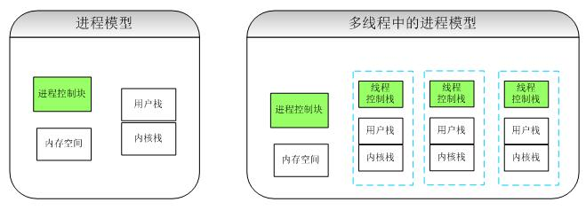

# 第二节 线程，进程和并发

## 进程
进程是什么？进程是正在执行的程序；进程是正在计算机上执行的程序实例；进程是能分配给处理器并由处理器执行的实体。
进程一般会包括指令集和系统资源集，这里的指令集是指程序代码，这里的系统资源集是指I/O、CPU、内存等。
综合起来，我们也可以理解进程是具有一定独立功能的程序在关于某个数据集合上的一次运行活动，
进程是系统进行资源分配和调度的一个独立单位。

在进程执行时，进程都可以被唯一的表示，由以下一些元素组成：

* 进程描述符：进程的唯一标识符，用来和其它进程区分。在Linux中叫进程ID，在系统调用fork期间生成，只是我们通过getpid返回的不是其pid字段，而是其线程组号tgid。
* 进程状态：我们常说的挂起、运行等状态，其表示的是当前的状态。
* 优先级：进程间的执行调度相关，相对于其它进程而言。
* 程序计数器：程序中即将被执行的下一条指令的地址，该地址是内核术中或用户内存空间中的内存地址。
* 内存指针：包括程序代码和进程相关数据的指针，还有和其它进程共享内存块的指针。
* 上下文数据：进程执行时处理器的寄存器的数据。
* I/O状态信息：包括显式的I/O请求、分配给进程的I/O设备等
* 记账信息：可能包括处理器时间总和、使用的时钟数总和、时间限制等

以上的这些元素都会放在一个叫做进程控制块的数据结构中。进程控制块是操作系统能够支持多进程和提供多处理的结构。
当操作系统做进程切换时，它会执行两步操作，一是中断当前处理器中的进程，二是执行下一个进程。
不管是中断还是执行，进程控制块中的程序计数器、上下文数据和进程状态都会发生变化。
当进程中断时，操作系统会把程序计数器和处理器寄存器（对应进程控制块中的上下文数据）保存到进程控制块中的相应位置，
进程状态也会有所变化，可能进入阻塞状态，也有可能进入就绪态。
当执行下一个进程时，操作系统按规则将下一个进程设置为运行态，并加载即将要执行进程的程序上下文数据和程序计数器等。

## 线程
进程有两个特性部分：资源所有权和调度执行。
资源所有权是指进程包括了进程运行所需要的内存空间、I/O等资源。
调度执行是指进程执行过程中间的执行路径，或者说程序的指令执行流。
这两个特性部分是可以分开的，分开后，拥有资料所有权的通常称为进程，拥有执行代码的可分派部分的被称之为线程或轻量级进程。

线程有“执行的线索”的意思在里面，而进程在多线程环境中被定义为资源所有者，其还是会存储进程的进程控制块。
线程的结构与进程不同，每个线程包括：

* 线程状态： 线程当前的状态。
* 一个执行栈
* 私有的数据区： 用于每个线程局部变量的静态存储空间
* 寄存器集： 存储处理器的一些状态

每个进程都有一个进程控制块和用户地址空间，每个线程都有一个独立的栈和独立的控制块，都有自己一个独立执行上下文。
其结构如图8.1所示。

线程在执行过程中与进程有一些不同。每个独立的线程有一个程序运行的入口、顺序执行序列和程序的出口。
但是线程不能够独立执行，必须依存在于进程之中，由进程提供多个线程执行控制。
从逻辑角度来看，多线程的意义在于一个进程中，有多个执行部分可以同时执行。
此时，进程本身不是基本运行单位，而是线程的容器。

线程较之进程，其优势在于一个快，不管是创建新的线程还是终止一个线程；不管是线程间的切换还是线程间共享数据或通信，其速度与进程相比都有较大的优势。

## 并发及并行
并发又称共行，是指能处理多个同时性活动的能力，并发事件之间不一定要同一时刻发生。
比如，现代计算机系统可在同一段时间内以进程的形式将多个程序加载到存储器中，并借由处理器的时分复用，
以在一个处理器上表现出同时运行的感觉。

并行是指同时发生的两个并发事件，具有并发的含义，而并发则不一定并行。

并发和并行的区别就是一个处理器同时处理多个任务和多个处理器或者是多核的处理器同时处理多个不同的任务。
前者是逻辑上的同时发生（simultaneous），而后者是物理上的同时发生。

### PHP的各种并发模型

既然有两种模型，那么PHP使用的是哪一种呢？答案是都支持，也就是说PHP支持多线程的模型，
在多线程情况下通常要解决资源共享和隔离的问题。PHP本身是线程安全的。

>具体来说是那种模型需要看使用的是哪个SAPI，比如说在Apache中，那么就可能使用多线程模型，
>也可能使用多进程模型。而php-fpm使用的就是多进程模型。

目前比较推荐的方式是使用php-fpm的模型，因为这个模型对于PHP来说有诸多的优势：

1. 内存释放简单，使用多进程模型时进程可以容易通过退出的方式来释放内存，
   由于PHP有非常多的扩展，稍有不慎就可能导致内存泄露，fpm通过进程退出方式
   简单除暴的解决了问题。
2. 容灾能力强，同样的问题，扩展或者php可能会出现段错误，如果是单进程多线程模型，
   那么整个PHP就挂掉了。这会影响服务，多进程的话，某个进程死掉了也不会影响整体的服务。

多进程有多进程的优势，多线程也有多线程的优势，比如HHVM它选择的是多线程模型。
多线程模型最大的好处是信息共享和通信方便，因为在同一个进程空间内，可以直接使用指针。

比如opcode cache工具，在PHP里，apc以及opcache等等使用的是共享内存来共享opcode，
那么在HHVM中则不需要走共享内存，共享内存还有个问题是存储复杂的数据结构不方便，
因为指针的问题，多线程情况下C/C++中的数据结构是可以共享的。这对效率提升也是有帮助的。

多进程和多线程还有一个明显的模型区别：在处理请求时的逻辑。

在多进程情况下，由于跨进程是不好传递fd连接的。那么多进程通常采用在父进程中`listen()`，
然后各个子进程`accept()`的方式来实现负载均衡。这样的模型下可能会有惊群的问题。

而多线程模型下，可以采用一个独立线程接受请求然后派发到各个worker线程的方式。

## 参考资料
《操作系统精髓与设计原理》