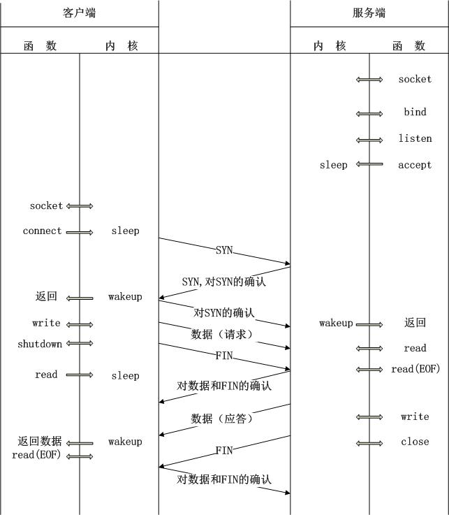

# FastCGI

## FastCGI简介

[CGI](http://zh.wikipedia.org/wiki/CGI)全称是“通用网关接口”(Common Gateway Interface)，
它可以让一个客户端，从网页浏览器向执行在Web服务器上的程序请求数据。
CGI描述了客户端和这个程序之间传输数据的一种标准。
CGI的一个目的是要独立于任何语言的，所以CGI可以用任何一种语言编写，只要这种语言具有标准输入、输出和环境变量。
如php，perl，tcl等。

[FastCGI](http://en.wikipedia.org/wiki/FastCGI)是Web服务器和处理程序之间通信的一种[协议](http://andylin02.iteye.com/blog/648412)，
是CGI的一种改进方案，[FastCGI](http://baike.baidu.com/view/641394.htm)像是一个常驻(long-live)型的CGI，
它可以一直执行，在请求到达时不会花费时间去fork一个进程来处理(这是CGI最为人诟病的fork-and-execute模式)。
正是因为他只是一个通信协议，它还支持分布式的运算，即 FastCGI 程序可以在网站服务器以外的主机上执行并且接受来自其它网站服务器来的请求。

FastCGI是语言无关的、可伸缩架构的CGI开放扩展，将CGI解释器进程保持在内存中，以此获得较高的性能。
CGI程序反复加载是CGI性能低下的主要原因，如果CGI程序保持在内存中并接受FastCGI进程管理器调度，
则可以提供良好的性能、伸缩性、Fail-Over特性等。

一般情况下，FastCGI的整个工作流程是这样的：

   1. Web Server启动时载入FastCGI进程管理器（IIS ISAPI或Apache Module)
   1. FastCGI进程管理器自身初始化，启动多个CGI解释器进程(可见多个php-cgi)并等待来自Web Server的连接。
   1. 当客户端请求到达Web Server时，FastCGI进程管理器选择并连接到一个CGI解释器。
      Web server将CGI环境变量和标准输入发送到FastCGI子进程php-cgi。
   1. FastCGI子进程完成处理后将标准输出和错误信息从同一连接返回Web Server。当FastCGI子进程关闭连接时，
      请求便告处理完成。FastCGI子进程接着等待并处理来自FastCGI进程管理器(运行在Web Server中)的下一个连接。 
	  在CGI模式中，php-cgi在此便退出了。

## PHP中的CGI实现

PHP的CGI实现了Fastcgi协议，是一个TCP或UDP协议的服务器接受来自Web服务器的请求，
当启动时创建TCP/UDP协议的服务器的socket监听，并接收相关请求进行处理。随后就进入了PHP的生命周期：
模块初始化，sapi初始化，处理PHP请求，模块关闭，sapi关闭等就构成了整个CGI的生命周期。

以TCP为例，在TCP的服务端，一般会执行这样几个操作步骤：

 1. 调用socket函数创建一个TCP用的流式套接字；
 1. 调用bind函数将服务器的本地地址与前面创建的套接字绑定；
 1. 调用listen函数将新创建的套接字作为监听，等待客户端发起的连接，当客户端有多个连接连接到这个套接字时，可能需要排队处理；
 1. 服务器进程调用accept函数进入阻塞状态，直到有客户进程调用connect函数而建立起一个连接；
 1. 当与客户端创建连接后，服务器调用read_stream函数读取客户的请求；
 1. 处理完数据后，服务器调用write函数向客户端发送应答。

TCP上客户-服务器事务的时序如图2.6所示：

PHP的CGI实现从cgi_main.c文件的main函数开始，在main函数中调用了定义在fastcgi.c文件中的初始化，监听等函数。
对比TCP的流程，我们查看PHP对TCP协议的实现，虽然PHP本身也实现了这些流程，但是在main函数中一些过程被封装成一个函数实现。
对应TCP的操作流程，PHP首先会执行创建socket，绑定套接字，创建监听：

    [c]
    if (bindpath) {
        fcgi_fd = fcgi_listen(bindpath, 128);   //  实现socket监听，调用fcgi_init初始化
        ...
    }

在fastcgi.c文件中，fcgi_listen函数主要用于创建、绑定socket并开始监听，它走完了前面所列TCP流程的前三个阶段，

    [c]
        if ((listen_socket = socket(sa.sa.sa_family, SOCK_STREAM, 0)) < 0 ||
            ...
            bind(listen_socket, (struct sockaddr *) &sa, sock_len) < 0 ||
            listen(listen_socket, backlog) < 0) {
            ...
        }

当服务端初始化完成后，进程调用accept函数进入阻塞状态，在main函数中我们看到如下代码：

    [c]
    	while (parent) {
			do {
				pid = fork();   //  生成新的子进程
				switch (pid) {
				case 0: //  子进程
					parent = 0;

					/* don't catch our signals */
					sigaction(SIGTERM, &old_term, 0);   //  终止信号
					sigaction(SIGQUIT, &old_quit, 0);   //  终端退出符
					sigaction(SIGINT,  &old_int,  0);   //  终端中断符
					break;
                    ...
                    default:
					/* Fine */
					running++;
					break;
			} while (parent && (running < children));

        ...
        	while (!fastcgi || fcgi_accept_request(&request) >= 0) {
			SG(server_context) = (void *) &request;
			init_request_info(TSRMLS_C);
			CG(interactive) = 0;
                        ...
                }

如上的代码是一个生成子进程，并等待用户请求。在fcgi_accept_request函数中，程序会调用accept函数阻塞新创建的进程。
当用户的请求到达时，fcgi_accept_request函数会判断是否处理用户的请求，其中会过滤某些连接请求，忽略受限制客户的请求，
如果程序受理用户的请求，它将分析请求的信息，将相关的变量写到对应的变量中。
其中在读取请求内容时调用了safe_read方法。如下所示：
**[main() -> fcgi_accept_request() -> fcgi_read_request() -> safe_read()]**

    [c]
    static inline ssize_t safe_read(fcgi_request *req, const void *buf, size_t count)
    {
        size_t n = 0;
        do {
        ... //  省略  对win32的处理
            ret = read(req->fd, ((char*)buf)+n, count-n);   //  非win版本的读操作
        ... //  省略
        } while (n != count);

    }

如上对应服务器端读取用户的请求数据。

在请求初始化完成，读取请求完毕后，就该处理请求的PHP文件了。
假设此次请求为PHP_MODE_STANDARD则会调用php_execute_script执行PHP文件。
在此函数中它先初始化此文件相关的一些内容，然后再调用zend_execute_scripts函数，对PHP文件进行词法分析和语法分析，生成中间代码，
并执行zend_execute函数，从而执行这些中间代码。关于整个脚本的执行请参见第三节 脚本的执行。

在处理完用户的请求后，服务器端将返回信息给客户端，此时在main函数中调用的是fcgi_finish_request(&request, 1);
fcgi_finish_request函数定义在fastcgi.c文件中，其代码如下：

    [c]
    int fcgi_finish_request(fcgi_request *req, int force_close)
    {
	int ret = 1;

	if (req->fd >= 0) {
		if (!req->closed) {
			ret = fcgi_flush(req, 1);
			req->closed = 1;
		}
		fcgi_close(req, force_close, 1);
	}
	return ret;
    }

如上，当socket处于打开状态，并且请求未关闭，则会将执行后的结果刷到客户端，并将请求的关闭设置为真。
将数据刷到客户端的程序调用的是fcgi_flush函数。在此函数中，关键是在于答应头的构造和写操作。
程序的写操作是调用的safe_write函数，而safe_write函数中对于最终的写操作针对win和linux环境做了区分，
在Win32下，如果是TCP连接则用send函数，如果是非TCP则和非win环境一样使用write函数。如下代码：

    [c]
    #ifdef _WIN32
	if (!req->tcp) {
		ret = write(req->fd, ((char*)buf)+n, count-n);
	} else {
		ret = send(req->fd, ((char*)buf)+n, count-n, 0);
		if (ret <= 0) {
				errno = WSAGetLastError();
		}
	}
    #else
	ret = write(req->fd, ((char*)buf)+n, count-n);
    #endif

在发送了请求的应答后，服务器端将会执行关闭操作，仅限于CGI本身的关闭，程序执行的是fcgi_close函数。
fcgi_close函数在前面提的fcgi_finish_request函数中，在请求应答完后执行。同样，对于win平台和非win平台有不同的处理。
其中对于非win平台调用的是write函数。

以上是一个TCP服务器端实现的简单说明。这只是我们PHP的CGI模式的基础，在这个基础上PHP增加了更多的功能。
在前面的章节中我们提到了每个SAPI都有一个专属于它们自己的sapi_module_struct结构：cgi_sapi_module，其代码定义如下：

    [c]
    /* {{{ sapi_module_struct cgi_sapi_module
     */
    static sapi_module_struct cgi_sapi_module = {
	"cgi-fcgi",						/* name */
	"CGI/FastCGI",					/* pretty name */

	php_cgi_startup,				/* startup */
	php_module_shutdown_wrapper,	/* shutdown */

	sapi_cgi_activate,				/* activate */
	sapi_cgi_deactivate,			/* deactivate */

	sapi_cgibin_ub_write,			/* unbuffered write */
	sapi_cgibin_flush,				/* flush */
	NULL,							/* get uid */
	sapi_cgibin_getenv,				/* getenv */

	php_error,						/* error handler */

	NULL,							/* header handler */
	sapi_cgi_send_headers,			/* send headers handler */
	NULL,							/* send header handler */

	sapi_cgi_read_post,				/* read POST data */
	sapi_cgi_read_cookies,			/* read Cookies */

	sapi_cgi_register_variables,	/* register server variables */
	sapi_cgi_log_message,			/* Log message */
	NULL,							/* Get request time */
	NULL,							/* Child terminate */

	STANDARD_SAPI_MODULE_PROPERTIES
    };
    /* }}} */

同样，以读取cookie为例，当我们在CGI环境下，在PHP中调用读取Cookie时，
最终获取的数据的位置是在激活SAPI时。它所调用的方法是read_cookies。
由SAPI实现来实现获取cookie，这样各个不同的SAPI就能根据自己的需要来实现一些依赖环境的方法。

    [c]
    SG(request_info).cookie_data = sapi_module.read_cookies(TSRMLS_C);
	
所有使用PHP的场合都需要定义自己的SAPI，例如在第一小节的Apache模块方式中，
sapi_module是apache2_sapi_module，其对应read_cookies方法的是php_apache_sapi_read_cookies函数，
而在我们这里，读取cookie的函数是sapi_cgi_read_cookies。
从sapi_module结构可以看出flush对应的是sapi_cli_flush，在win或非win下，flush对应的操作不同，
在win下，如果输出缓存失败，则会和嵌入式的处理一样，调用php_handle_aborted_connection进入中断处理程序，
而其它情况则是没有任何处理程序。这个区别通过cli_win.c中的PHP_CLI_WIN32_NO_CONSOLE控制。

## 参考资料
  
* http://www.fastcgi.com/drupal/node/2  
* http://baike.baidu.com/view/641394.htm  

