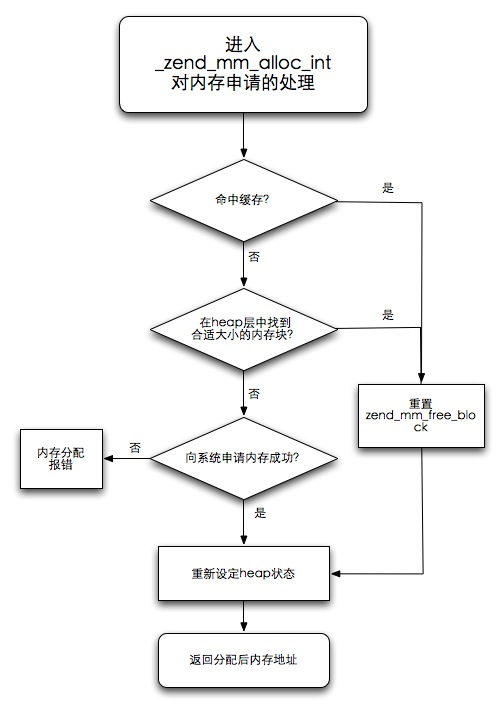

# 第三节 内存使用：申请和销毁
## 内存的申请
通过前一小节我们可以知道，PHP底层对内存的管理，
围绕着小块内存列表（free_buckets）、 大块内存列表（large_free_buckets）和
剩余内存列表（rest_buckets）三个列表来分层进行的。
ZendMM向系统进行的内存申请，并不是有需要时向系统即时申请，
而是由ZendMM的最底层（heap层）先向系统申请一大块的内存，通过对上面三种列表的填充，
建立一个类似于内存池的管理机制。
在程序运行需要使用内存的时候，ZendMM会在内存池中分配相应的内存供使用。
这样做的好处是避免了PHP向系统频繁的内存申请操作，如下面的代码：

	[php]
	<?php
	$tipi = "o_o\n";
	echo $tipi;
	?>

这是一个简单的php程序，但通过对emalloc的调用计数，发现对内存的请求有数百次之多，
当然这非常容易解释，因为PHP脚本的执行，需要大量的环境变量以及内部变量的定义，
这些定义本身都是需要在内存中进行存储的。

>**NOTE**
>在编写PHP的扩展时，推荐使用emalloc来代替malloc，其实也就是使用PHP的ZendMM来代替
>手动直接调用系统级的内存管理。（除非，你自己知道自已在做什么。）

那么在上面这个小程序的执行过程中，ZendMM是如何使用自身的heap层存储空间的呢？
经过对源码的追踪我们可以找到：

	[c]
	   ZEND_ASSIGN_SPEC_CV_CONST_HANDLER (......)
	-> ALLOC_ZVAL(......)
	-> ZEND_FAST_ALLOC(......) 
	-> emalloc (......)
	-> _emalloc(......)
	-> _zend_mm_alloc_int(.....)

***void *_emalloc*** 实现了对内存的申请操作，在_emalloc的处理过程中，
对是否使用ZendMM进行了判断，如果heap层没有使用ZendMM来管理，
就直接使用_zend_mm_heap结构中定义的_malloc函数进行内存的分配;
（我们通过上节可以知道，这里的_malloc可以是malloc，win32，mmap_anon，mmap_zero中的一种）;

就目前所知，不使用ZendMM进行内存管理，唯一的用途是打开enable-debug开关后，
可以更方便的追踪内存的使用情况。所以，在这里我们关注ZendMM使用_zend_mm_alloc_int函数进行内存分配:

结合上图，再加上内存分配之前的验证，ZendMM对内存分配的处理主要有以下步骤：

 1. 内存检查。 对要申请的内存大小进行检查，如果太大（超出memory_limit则报 Out of Memory）;
 2. 如果命中缓存，使用fastcache得到内存块(详见第五节)，然后直接进行第5步;
 3. 在ZendMM管理的heap层存储中搜索合适大小的内存块, 在这一步骤ZendMM通过与ZEND_MM_MAX_SMALL_SIZE进行大小比较，
把内存请求分为两种类型： large和small。small类型的的请求会先使用zend_mm_low_bit函数
在mm_heap中的free_buckets中查找，未找到则使用与large类型相同的方式：
使用zend_mm_search_large_block函数在“大块”内存（_zend_mm_heap->large_free_buckets）中进行查找。
如果还没有可以满足大小需求的内存，最后在rest_buckets中进行查找。
也就是说，内存的分配是在三种列表中小到大进行的。
找到可以使用的block后，进行第5步;
 4. 如果经过第3步的查找还没有找到可以使用的资源（请求的内存过大），需要使用ZEND_MM_STORAGE_ALLOC函数向系统再申请一块内存（大小至少为ZEND_MM_SEG_SIZE），然后直接将对齐后的地址分配给本次请求。跳到第6步;
 5. 使用zend_mm_remove_from_free_list函数将已经使用block节点在zend_mm_free_block中移除;
 6. 内存分配完毕，对zend_mm_heap结构中的各种标识型变量进行维护，包括large_free_buckets， peak，size等;
 7. 返回分配的内存地址;

从上面的分配可以看出，PHP对内存的分配，是结合PHP的用途来设计的，PHP一般用于web应用程序的数据支持，
单个脚本的运行周期一般比较短（最多达到秒级），内存大块整块的申请，自主进行小块的分配，
没有进行比较复杂的不相临地址的空闲内存合并，而是集中再次向系统请求。
这样做的好处就是运行速度会更快，缺点是随着程序的运行时间的变长，
内存的使用情况会“越来越多”（PHP5.2及更早版本）。
所以PHP5.3之前的版本并不适合做为守护进程长期运行。
（当然，可以有其他方法解决，而且在PHP5.3中引入了新的GC机制，详见下一小节）

## 内存的销毁
ZendMM在内存销毁的处理上采用与内存申请相同的策略，当程序unset一个变量或者是其他的释放行为时，
ZendMM并不会直接立刻将内存交回给系统，而是只在自身维护的内存池中将其重新标识为可用，
按照内存的大小整理到上面所说的三种列表（small,large,free）之中，以备下次内存申请时使用。

>**NOTE**
>关于变量销毁的处理，还涉及较多的其他操作，请参看[变量的创建和销毁][var-create-free]

内存销毁的最终实现函数是**_efree**。在**_efree**中，内存的销毁首先要进行是否放回cache的判断。
如果内存的大小满足ZEND_MM_SMALL_SIZE并且cache还没有超过系统设置的ZEND_MM_CACHE_SIZE，
那么，当前内存块zend_mm_block就会被放回mm_heap->cache中。
如果内存块没有被放回cache，则使用下面的代码进行处理：

	[c]
    zend_mm_block *mm_block; //要销毁的内存块
    zend_mm_block *next_block;
    ...
    next_block = ZEND_MM_BLOCK_AT(mm_block, size);
    if (ZEND_MM_IS_FREE_BLOCK(next_block)) {
        zend_mm_remove_from_free_list(heap, (zend_mm_free_block *) next_block);
        size += ZEND_MM_FREE_BLOCK_SIZE(next_block);
    }    
    if (ZEND_MM_PREV_BLOCK_IS_FREE(mm_block)) {
        mm_block = ZEND_MM_PREV_BLOCK(mm_block);
        zend_mm_remove_from_free_list(heap, (zend_mm_free_block *) mm_block);
        size += ZEND_MM_FREE_BLOCK_SIZE(mm_block);
    }    
    if (ZEND_MM_IS_FIRST_BLOCK(mm_block) &&
        ZEND_MM_IS_GUARD_BLOCK(ZEND_MM_BLOCK_AT(mm_block, size))) {
        zend_mm_del_segment(heap, (zend_mm_segment *) ((char *)mm_block - ZEND_MM_ALIGNED_SEGMENT_SIZE));
    } else {
        ZEND_MM_BLOCK(mm_block, ZEND_MM_FREE_BLOCK, size);
        zend_mm_add_to_free_list(heap, (zend_mm_free_block *) mm_block);
    }    

这段代码逻辑比较清晰，主要是根据当前要销毁的内存块**mm_block**在**zend_mm_heap**
双向链表中所处的位置进行不同的操作。如果下一个节点还是free的内存，则将下一个节点合并;
如果上一相邻节点内存块为free，则合并到上一个节点;
如果只是普通节点，刚使用 **zend_mm_add_to_free_list**或者**zend_mm_del_segment**
进行回收。

就这样，ZendMM将内存块以整理收回到zend_mm_heap的方式，回收到内存池中。
程序使用的所有内存，将在进程结束时统一交还给系统。

>**NOTE**
>在内存的销毁过程中，还涉及到引用计数和垃圾回收（GC），将在下一小节进行讨论。

[var-create-free]: ?p=chapt03/03-06-01-var-define-and-init
