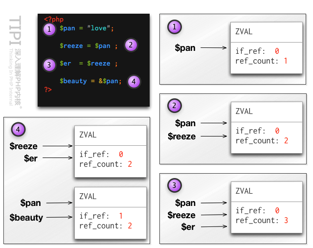

# 第六节 写时复制（Copy On Write）

在开始之前，我们可以先看一段简单的代码：
	
	[php]
	<?php   //例一
		$foo = 1;
		$bar = $foo;
		echo $foo + $bar;
	?>

执行这段代码，会打印出数字2。从内存的角度来分析一下这段代码“可能”是这样执行的：
分配一块内存给foo变量，里面存储一个1； 再分配一块内存给bar变量，也存一个1，最后计算出结果输出。
事实上，我们发现foo和bar变量因为值相同，完全可以使用同一块内存，这样，内存的使用就节省了一个1，
并且，还省去了分配内存和管理内存地址的计算开销。
没错，很多涉及到内存管理的系统，都实现了这种相同值共享内存的策略：**写时复制**

很多时候，我们会因为一些术语而对其概念产生莫测高深的恐惧，而其实，他们的基本原理往往非常简单。
本小节将介绍PHP中写时复制这种策略的实现：

>**NOTE**
>写时复制（[Copy on Write](http://en.wikipedia.org/wiki/Copy-on-write)，也缩写为COW)的应用场景非常多，
>比如Linux中对进程复制中内存使用的优化，在各种编程语言中，如C++的STL等等中均有类似的应用。
>COW是常用的优化手段，可以归类于：资源延迟分配。只有在真正需要使用资源时才占用资源，
>写时复制通常能减少资源的占用。

注： 为节省篇幅，下文将统一使用COW来表示“写时复制”； 

## 推迟内存复制的优化

正如前面所说，PHP中的COW可以简单描述为：如果通过赋值的方式赋值给变量时不会申请新内存来存放
新变量所保存的值，而是简单的通过一个计数器来共用内存，只有在其中的一个引用指向变量的
值发生变化时才申请新空间来保存值内容以减少对内存的占用。
在很多场景下PHP都COW进行内存的优化。比如：变量的多次赋值、函数参数传递，并在函数体内修改实参等。
    
下面让我们看一个查看内存的例子，可以更容易看到COW在内存使用优化方面的明显作用：

	[php]
	<?php  //例二
	$j = 1;
			var_dump(memory_get_usage());

	$tipi = array_fill(0, 100000, 'php-internal');
			var_dump(memory_get_usage());

	$tipi_copy = $tipi;
			var_dump(memory_get_usage());

	foreach($tipi_copy as $i){
		$j += count($i); 
	}
			var_dump(memory_get_usage());

	//-----执行结果-----
	$ php t.php 
	int(630904)
	int(10479840)
	int(10479944)
	int(10480040)

上面的代码比较典型的突出了COW的作用，在数组变量`$tipi`被赋值给`$tipi_copy`时，
内存的使用并没有立刻增加一半，在循环遍历数`$tipi_copy`时也没有发生显著变化，
在这里`$tipi_copy`和`$tipi`变量的数据共同指向同一块内存，而没有复制。

也就是说，即使我们不使用引用，一个变量被赋值后，只要我们不改变变量的值 ，也不会新申请内存用来存放数据。
据此我们很容易就可以想到一些COW可以非常有效的控制内存使用的场景：
只是使用变量进行计算而很少对其进行修改操作，如函数参数的传递，大数组的复制等等等不需要改变变量值的情形。

##复制分离变化的值
多个相同值的变量共用同一块内存的确节省了内存空间，但变量的值是会发生变化的，如果在上面的例子中，
指向同一内存的值发生了变化（或者可能发生变化），就需要将变化的值“分离”出去，这个“分离”的操作，
就是“复制”。

在PHP中，Zend引擎为了区别同一个zval地址是否被多个变量共享，引入了ref_count和is_ref两个变量进行标识：

>**NOTE**
>__ref_count__和__is_ref__是定义于zval结构体中（见第一章第一小节）    
>__is_ref__标识是不是用户使用 & 的强制引用；	 
>__ref_count__是引用计数，用于标识此zval被多少个变量引用，即COW的自动引用，为0时会被销毁；	
关于这两个变量的更多内容，跳转阅读：[第三章第六节：变量的赋值和销毁][var-define-and-init]的实现。    
>注：由此可见， $a=$b; 与 $a=&$b; 在PHP对内存的使用上没有区别（值不变化时）；	

下面我们把**例二**稍做变化：如果`$copy`的值发生了变化，会发生什么？：

	[php]
	<?php //例三
	//$tipi = array_fill(0, 3, 'php-internal');  
	//这里不再使用array_fill来填充 ，为什么？
	$tipi[0] = 'php-internal';
	$tipi[1] = 'php-internal';
	$tipi[2] = 'php-internal';
	var_dump(memory_get_usage());

	$copy = $tipi;
	xdebug_debug_zval('tipi', 'copy');
	var_dump(memory_get_usage());

	$copy[0] = 'php-internal';
	xdebug_debug_zval('tipi', 'copy');
	var_dump(memory_get_usage());

	//-----执行结果-----
	$ php t.php 
	int(629384)
	tipi: (refcount=2, is_ref=0)=array (0 => (refcount=1, is_ref=0)='php-internal', 
										1 => (refcount=1, is_ref=0)='php-internal', 
										2 => (refcount=1, is_ref=0)='php-internal')
	copy: (refcount=2, is_ref=0)=array (0 => (refcount=1, is_ref=0)='php-internal', 
										1 => (refcount=1, is_ref=0)='php-internal', 
										2 => (refcount=1, is_ref=0)='php-internal')
	int(629512)
	tipi: (refcount=1, is_ref=0)=array (0 => (refcount=1, is_ref=0)='php-internal', 
										1 => (refcount=2, is_ref=0)='php-internal', 
										2 => (refcount=2, is_ref=0)='php-internal')
	copy: (refcount=1, is_ref=0)=array (0 => (refcount=1, is_ref=0)='php-internal', 
										1 => (refcount=2, is_ref=0)='php-internal', 
										2 => (refcount=2, is_ref=0)='php-internal')
	int(630088)

在这个例子中，我们可以发现以下特点：

   1. $copy = $tipi；这种基本的赋值操作会触发COW的内存“共享”，不会产生内存复制；
   1. COW的粒度为zval结构，由PHP中变量全部基于zval，所以COW的作用范围是全部的变量，而对于zval结构体组成的集合（如数组和对象等），
在需要复制内存时，将复杂对象分解为最小粒度来处理。这样可以使内存中复杂对象中某一部分做修改时，
不必将该对象的所有元素全部“分离复制”出一份内存拷贝；
   
>**NOTE**
>array_fill()填充数组时也采用了COW的策略，可能会影响对本例的演示，感兴趣的读者可以
>阅读：$PHP_SRC/ext/standard/array.c中PHP_FUNCTION(array_fill)的实现。    
>    
>xdebug_debug_zval()是xdebug扩展中的一个函数，用于输出变量在zend内部的引用信息。
>如果你没有安装xdebug扩展，也可以使用debug_zval_dump()来代替。
>参考：<http://www.php.net/manual/zh/function.debug-zval-dump.php>

## 实现写时复制

看完上面的三个例子，相信大家也可以了解到PHP中COW的实现原理：
PHP中的COW基于引用计数__ref_count__和__is_ref__实现，
多一个变量指针，就将__ref_count__加1， 反之减去1，减到0就销毁；
同理，多一个强制引用&,就将__is_ref__加1，反之减去1。

这里有一个比较典型的例子：
	
	[php]
	<?php  //例四
		$foo = 1;
		xdebug_debug_zval('foo');
		$bar = $foo;
		xdebug_debug_zval('foo');
		$bar = 2;
		xdebug_debug_zval('foo');
	?>
	//-----执行结果-----
	foo: (refcount=1, is_ref=0)=1
	foo: (refcount=2, is_ref=0)=1
	foo: (refcount=1, is_ref=0)=1
	
经过前面对变量章节的介绍，我们知道当$foo被赋值时，$foo变量的值的只由$foo变量指向。
当$foo的值被赋给$bar时，PHP并没有将内存复制一份交给$bar，而是把$foo和$bar指向同一个地址。
同时引用计数增加1，也就是新的2。
随后，我们更改了$bar的值，这时如果直接需该$bar变量指向的内存，则$foo的值也会跟着改变。
这不是我们想要的结果。于是，PHP内核将内存复制出来一份，并将其值更新为赋值的：2（这个操作也称为变量分离操作），
同时原$foo变量指向的内存只有$foo指向，所以引用计数更新为：refcount=1。

看上去很简单，但由于**&**运算符的存在，实际的情形要复杂的多。
见下面的例子：

从这个例子可以看出PHP对**&**运算符的一个容易出问题的处理：当 $beauty=&$pan; 时，
两个变量本质上都变成了引用类型，导致看上去的普通变量$pan, 在某些内部处理中与&$pan行为相同，
尤其是在数组元素中使用引用变量，很容易引发问题。（见最后的例子）

PHP的大多数工作都是进行文本处理，而变量是载体，不同类型的变量的使用贯穿着PHP的生命周期，
变量的COW策略也就体现了Zend引擎对变量及其内存处理，具体可以参阅源码文件相关的内容：

	[c]
	Zend/zend_execute.c
	========================================
		zend_assign_to_variable_reference();
		zend_assign_to_variable();
		zend_assign_to_object();
		zend_assign_to_variable();
		
	//以及下列宏定义的使用
	Zend/zend.h
	========================================
		#define Z_REFCOUNT(z)           Z_REFCOUNT_P(&(z))
		#define Z_SET_REFCOUNT(z, rc)       Z_SET_REFCOUNT_P(&(z), rc)
		#define Z_ADDREF(z)         Z_ADDREF_P(&(z))
		#define Z_DELREF(z)         Z_DELREF_P(&(z))
		#define Z_ISREF(z)          Z_ISREF_P(&(z))
		#define Z_SET_ISREF(z)          Z_SET_ISREF_P(&(z))
		#define Z_UNSET_ISREF(z)        Z_UNSET_ISREF_P(&(z))
		#define Z_SET_ISREF_TO(z, isref)    Z_SET_ISREF_TO_P(&(z), isref)	
	

## 最后，请慎用引用**&**
引用和前面提到的变量的引用计数和PHP中的引用并不是同一个东西，
引用和C语言中的指针的类似，他们都可以通过不同的标示访问到同样的内容，
但是PHP的引用则只是简单的变量别名，没有C指令的灵活性和限制。

PHP中有非常多让人觉得意外的行为，有些因为历史原因，不能破坏兼容性而选择
暂时不修复，或者有的使用场景比较少。在PHP中只能尽量的避开这些陷阱。
例如下面这个例子。

由于引用操作符会导致PHP的COW策略优化，所以使用引用也需要对引用的行为有明确的认识才不至于误用，
避免带来一些比较难以理解的的Bug。如果您认为您已经足够了解了PHP中的引用，可以尝试解释下面这个例子：

	[php]
	<?php
	$foo['love'] = 1;
	$bar  = &$foo['love'];
	$tipi = $foo;
	$tipi['love'] = '2';
	echo $foo['love'];
	
这个例子最后会输出 2 ， 大家会非常惊讶于$tipi怎么会影响到$foo, 
`$bar`变量的引用操作，将$foo['love']污染变成了引用，从而Zend没有
对`$tipi['love']`的修改产生内存的复制分离。

[var-define-and-init]:	?p=chapt03/03-06-01-var-define-and-init
