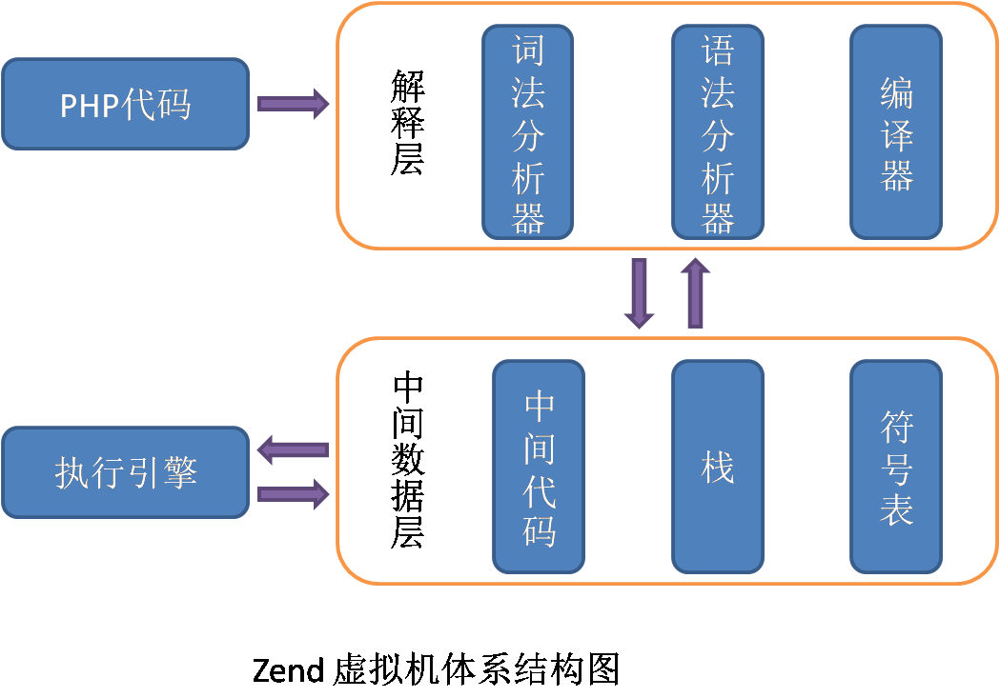

#  第一节 Zend虚拟机概述

在wiki中[虚拟机](http://zh.wikipedia.org/wiki/虚拟机)的定义是：
虚拟机（Virtual Machine），在计算机科学中的体系结构里，是指一种特殊的软件，
他可以在计算机平台和终端用户之间创建一种环境，而终端用户则是基于这个软件所创建的环境来操作软件。
在计算机科学中，虚拟机是指可以像真实机器一样运行程序的计算机的软件实现。

虚拟机是一种抽象的计算机，它有自己的指令集，有自己的内存管理体系。
在此类虚拟机上实现的语言比较低抽象层次的语言更加明了，更加简单易学。

## 虚拟机的类型

虚拟机是一种抽象的计算机，是对真实计算机的虚拟和模拟，现在的计算机有不同的
指令集架构([ISA: Instruction Set Architecture](http://homedir.jct.ac.il/~citron/ca/isa.html))，
ISA是处理的一个部分，不同的处理器会有不同的架构，最常见的有3种：

- 基于栈的[Stack Machines](http://en.wikipedia.org/wiki/Stack_machine): 操作数保存在栈上。
  而不是使用寄存器来保存，现在很少有真实机器采用这个模型。对于虚拟机来说因为指令空间占用少，
  并且实现简单，很多虚拟机采用这种模型，比如：JVM，HHVM等。
- 基于累加器的Accumulator Machines。这个模型使用称作累加器(Accumulator)的的寄存器来保存
  一个操作数以及操作的结果
- 基于通用寄存器的General-Purpose-Register Machines，这些寄存器没有特殊的用途。
  编译器可以将操作数保存在这些寄存器中。ZendVM采用的就是基于寄存器的架构。


```php
<?php

$a = 0;

if ($a > 0) {
	echo $a;
} else {
	echo 4;
}
```

下图为上面PHP代码编译后的opcode，可以看出来操作数使用的是一些数字，他们也可以理解对应于
物理机的寄存器，不同的是在这一个层次寄存器的数量可以理解为无限的，而物理机的寄存器是有限的。

```
line     # *  op                           fetch          ext  return  operands
---------------------------------------------------------------------------------
   4     0  >   ASSIGN                                                   !0, 0
   6     1      IS_SMALLER                                       ~1      0, !0
         2    > JMPZ                                                     ~1, ->5
   7     3  >   ECHO                                                     !0
   8     4    > JMP                                                      ->6
   9     5  >   ECHO                                                     4
  10     6  > > RETURN                                                   1
```

我们再看看基于栈的HHVM生成的opcode

```
Pseudo-main at 0 (ID 0)
  // line 4
    0: Int 0
    9: SetL 0
   11: PopC
  // line 6
   12: Int 0
   21: CGetL2 0
   23: Gt
   24: JmpZ 14 (38)
  // line 7
   29: CGetL 0
   31: Print
   32: PopC
  // line 10
   33: Jmp 16 (49)
  // line 9
   38: Int 4
   47: Print
   48: PopC
   49: Int 1
   58: RetC
Pseudo-main at 0 (ID 0)
```

它就是基于栈的模式，指令的操作数都是保存在栈上的。可以看出来，相比于Zend的实现，
指令数量多了不少。虽然指令数多了不少，在实际项目中，由于HHVM使用了JIT技术，
这些指令并不会解释执行，所以HHVM会比PHP快不少。


> 目前的程序语言虚拟机大都采用基于栈的，这是因为程序最终是解释执行的，虚拟机中的对象
> 通用并不容易对应到物理机中的寄存器，放在寄存器的好处是性能，这点优势没有了的话，
> 采用更为复杂的基于寄存器的实现就不合适了。不过对于实现了JIT的虚拟机来说，他最后
> 还是会把程序编译成基于寄存器的，因为要做JIT，就是把虚拟机的指令集(ISA)翻译成目标机器
> 的指令集，也就是我们真实的物理机，而它是基于寄存器的。从逻辑上虚拟机还是基于栈的，
> 不过优化的时候会映射到基于寄存器的物理机。


## Zend虚拟机核心实现代码
为了方便读者对Zend引擎的实现有个全面的感觉，下面列出涉及到Zend引擎实现的核心代码文件功能参考。

Zend引擎的核心文件都在$PHP\_SRC/Zend/目录下面。不过最为核心的文件只有如下几个：

1. PHP语法实现
    - Zend/zend\_language\_scanner.l
    - Zend/zend\_language\_parser.y
1. Opcode编译
    - Zend/zend\_compile.c
2. 执行引擎
    - Zend/zend\_vm\_\*
    - Zend/zend\_execute.c

## Zend虚拟机体系结构

从概念层将Zend虚拟机的实现进行抽象，我们可以将Zend虚拟机的体系结构分为：解释层、执行引擎、中间数据层，如图7.1所示：



当一段PHP代码进入Zend虚拟机，它会被执行两步操作:编译和执行。
对于一个解释性语言来说，这是一个创造性的举动，但是，现在的实现并不彻底。
现在当PHP代码进入Zend虚拟机后，它虽然会被执行这两步操作，但是这两步操作对于一个常规的执行过程来说却是连续的，
也就是说它并没有转变成和Java这种编译型语言一样：生成一个中间文件存放编译后的结果。
如果每次执行这样的操作，对于PHP脚本的性能来说是一个极大的损失。
虽然有类似于APC，eAccelerator等缓存解决方案。但是其本质上是没有变化的，并且不能将两个步骤分离，各自发展壮大。

### 解释层
解释层是Zend虚拟机执行编译过程的位置。它包括词法解析、语法解析和编译生成中间代码三个部分。
词法分析就是将我们要执行的PHP源文件，去掉空格，去掉注释，切分为一个个的标记(token)，
并且处理程序的层级结构(hierarchical structure)。

语法分析就是将接受的标记(token)序列，根据定义的语法规则，来执行一些动作，Zend虚拟机现在使用的Bison使用巴科斯范式(BNF)来描述语法。
编译生成中间代码是根据语法解析的结果对照Zend虚拟机制定的opcode生成中间代码，
在PHP5.3.1中，Zend虚拟机支持135条指令（见Zend/zend_vm_opcodes.h文件），
无论是简单的输出语句还是程序复杂的递归调用，Zend虚拟机最终都会将所有我们编写的PHP代码转化成这135条指令的序列，
之后在执行引擎中按顺序执行。

### 中间数据层
当Zend虚拟机执行一个PHP代码时，它需要内存来存储许多东西，
比如，中间代码，PHP自带的函数列表，用户定义的函数列表，PHP自带的类，用户自定义的类，
常量，程序创建的对象，传递给函数或方法的参数，返回值，局部变量以及一些运算的中间结果等。
我们把这些所有的存放数据的地方称为中间数据层。

如果PHP以mod扩展的方式依附于Apache2服务器运行，中间数据层的部分数据可能会被多个线程共享，如果PHP自带的函数列表等。
如果只考虑单个进程的方式，当一个进程被创建时它就会被加载PHP自带的各种函数列表，类列表，常量列表等。
当解释层将PHP代码编译完成后，各种用户自定义的函数，类或常量会添加到之前的列表中，
只是这些函数在其自身的结构中某些字段的赋值是不一样的。

当执行引擎执行生成的中间代码时，会在Zend虚拟机的栈中添加一个新的执行中间数据结构（zend_execute_data），
它包括当前执行过程的活动符号列表的快照、一些局部变量等。

### 执行引擎
Zend虚拟机的执行引擎是一个非常简单的实现，它只是依据中间代码序列（EX(opline)）,一步一步调用对应的方法执行。
在执行引擎中没并有类似于PC寄存器一样的变量存放下一条指令，当Zend虚拟机执行到某条指令时，当它所有的任务都执行完了，
这条指令会自己调用下一条指令，即将序列的指针向前移动一个位置，从而执行下一条指令，并且在最后执行return语句，如此反复。
这在本质上是一个函数嵌套调用。

回到开头的问题，PHP通过词法分析、语法分析和中间代码生成三个步骤后，PHP文件就会被解析成PHP的中间代码opcode。
生成的中间代码与实际的PHP代码之间并没有完全的一一对应关系。只是针对用户所给的PHP代码和PHP的语法规则和一些内部约定生成中间代码，
并且这些中间代码还需要依靠一些全局变量中转数据和关联。至于生成的中间代码的执行过程是依据中间代码的顺利，
依赖于执行过程中的全局变量，一步步执行。当然，在遇到一些函数跳转也会发生偏移，但是最终还是会回到偏移点。

