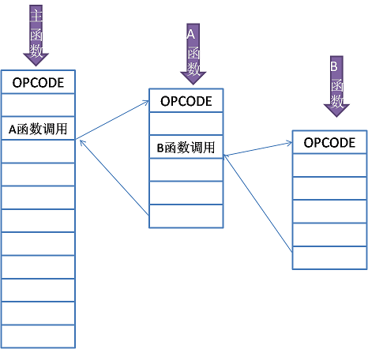

# 第三节 中间代码的执行

在[<< 第二章第三小节 PHP脚本的执行 -- opcode >>][opcode]中， 我们对opcode进行了一个简略的说明。
这一小节我们讲这些中间代码在Zend虚拟机中是如何被执行的。

假如我们现在使用的是CLI模式，直接在SAPI/cli/php_cli.c文件中找到main函数，
默认情况下PHP的CLI模式的行为模式为PHP_MODE_STANDARD。
此行为模式中PHP内核会调用php_execute_script(&file_handle TSRMLS_CC);来执行PHP文件。
顺着这条执行的线路，可以看到一个PHP文件在经过词法分析，语法分析，编译后生成中间代码的过程：

    [c]
    EG(active_op_array) = zend_compile_file(file_handle, type TSRMLS_CC);

在销毁了文件所在的handler后，如果存在中间代码，则PHP虚拟机将通过以下代码执行中间代码：

    [c]
    zend_execute(EG(active_op_array) TSRMLS_CC);

如果你是使用VS查看源码的话，将光标移到zend_execute并直接按F12，
你会发现zend_execute的定义跳转到了一个指针函数的声明(Zend/zend_execute_API.c)。

    [c]
    ZEND_API void (*zend_execute)(zend_op_array *op_array TSRMLS_DC);

这是一个全局的函数指针，它的作用就是执行PHP代码文件解析完的转成的zend_op_array。
和zend_execute相同的还有一个zedn_execute_internal函数，它用来执行内部函数。
在PHP内核启动时(zend_startup)时，这个全局函数指针将会指向execute函数。
注意函数指针前面的修饰符ZEND_API，这是ZendAPI的一部分。
在zend_execute函数指针赋值时，还有PHP的中间代码编译函数zend_compile_file（文件形式）和zend_compile_string(字符串形式)。

    [c]
    zend_compile_file = compile_file;
	zend_compile_string = compile_string;
	zend_execute = execute;
	zend_execute_internal = NULL;
	zend_throw_exception_hook = NULL;

这几个全局的函数指针均只调用了系统默认实现的几个函数，比如compile_file和compile_string函数，
他们都是以全局函数指针存在，这种实现方式在PHP内核中比比皆是，其优势在于更低的耦合度，甚至可以定制这些函数。
比如在APC等opcode优化扩展中就是通过替换系统默认的zend_compile_file函数指针为自己的函数指针my_compile_file，
并且在my_compile_file中增加缓存等功能。

到这里我们找到了中间代码执行的最终函数：execute(Zend/zend_vm_execure.h)。
在这个函数中所有的中间代码的执行最终都会调用handler。这个handler是什么呢？

    [c]
    if ((ret = EX(opline)->handler(execute_data TSRMLS_CC)) > 0) {
    }

这里的handler是一个函数指针，它指向执行该opcode时调用的处理函数。
此时我们需要看看handler函数指针是如何被设置的。
在前面我们有提到和execute一起设置的全局指针函数：zend_compile_string。
它的作用是编译字符串为中间代码。在Zend/zend_language_scanner.c文件中有compile_string函数的实现。
在此函数中，当解析完中间代码后，一般情况下，它会执行pass_two(Zend/zend_opcode.c)函数。
pass_two这个函数，从其命名上真有点看不出其意义是什么。
但是我们关注的是在函数内部，它遍历整个中间代码集合，
调用ZEND_VM_SET_OPCODE_HANDLER(opline);为每个中间代码设置处理函数。
ZEND_VM_SET_OPCODE_HANDLER是zend_vm_set_opcode_handler函数的接口宏，
zend_vm_set_opcode_handler函数定义在Zend/zend_vm_execute.h文件。
其代码如下：

    [c]
    static opcode_handler_t zend_vm_get_opcode_handler(zend_uchar opcode, zend_op* op)
    {
            static const int zend_vm_decode[] = {
                _UNUSED_CODE, /* 0              */
                _CONST_CODE,  /* 1 = IS_CONST   */
                _TMP_CODE,    /* 2 = IS_TMP_VAR */
                _UNUSED_CODE, /* 3              */
                _VAR_CODE,    /* 4 = IS_VAR     */
                _UNUSED_CODE, /* 5              */
                _UNUSED_CODE, /* 6              */
                _UNUSED_CODE, /* 7              */
                _UNUSED_CODE, /* 8 = IS_UNUSED  */
                _UNUSED_CODE, /* 9              */
                _UNUSED_CODE, /* 10             */
                _UNUSED_CODE, /* 11             */
                _UNUSED_CODE, /* 12             */
                _UNUSED_CODE, /* 13             */
                _UNUSED_CODE, /* 14             */
                _UNUSED_CODE, /* 15             */
                _CV_CODE      /* 16 = IS_CV     */
            };
            return zend_opcode_handlers[opcode * 25 
                    + zend_vm_decode[op->op1.op_type] * 5 
                    + zend_vm_decode[op->op2.op_type]];
    }

    ZEND_API void zend_vm_set_opcode_handler(zend_op* op)
    {
        op->handler = zend_vm_get_opcode_handler(zend_user_opcodes[op->opcode], op);
    }

在前面章节[<< 第二章第三小节 -- opcode处理函数查找 >>][opcode-handler]中介绍了四种查找opcode处理函数的方法，
而根据其本质实现查找也在其中，只是这种方法对于计算机来说比较容易识别，而对于自然人来说却不太友好。
比如一个简单的A + B的加法运算，如果你想用这种方法查找其中间代码的实现位置的话，
首先你需要知道中间代码的代表的值，然后知道第一个表达式和第二个表达式结果的类型所代表的值，
然后计算得到一个数值的结果，然后从数组zend_opcode_handlers找这个位置，位置所在的函数就是中间代码的函数。
这对阅读代码的速度没有好处，但是在开始阅读代码的时候根据代码的逻辑走这样一个流程却是大有好处。

回到正题。
handler所指向的方法基本都存在于Zend/zend_vm_execute.h文件文件。
知道了handler的由来，我们就知道每个opcode调用handler指针函数时最终调用的位置。

在opcode的处理函数执行完它的本职工作后，常规的opcode都会在函数的最后面添加一句：ZEND_VM_NEXT_OPCODE();。
这是一个宏，它的作用是将当前的opcode指针指向下一条opcode，并且返回0。如下代码：

    [c]
    #define ZEND_VM_NEXT_OPCODE() \
	CHECK_SYMBOL_TABLES() \
	EX(opline)++; \
	ZEND_VM_CONTINUE()

    #define ZEND_VM_CONTINUE()   return 0

在execute函数中，处理函数的执行是在一个while(1)循环作用范围中。如下：

    [c]
    
	while (1) {
            int ret;
    #ifdef ZEND_WIN32
            if (EG(timed_out)) {
                zend_timeout(0);
            }
    #endif

            if ((ret = EX(opline)->handler(execute_data TSRMLS_CC)) > 0) {
                switch (ret) {
                    case 1:
                        EG(in_execution) = original_in_execution;
                        return;
                    case 2:
                        op_array = EG(active_op_array);
                        goto zend_vm_enter;
                    case 3:
                        execute_data = EG(current_execute_data);
                    default:
                        break;
                }
            }

        }

前面说到每个中间代码在执行完后都会将中间代码的指针指向下一条指令，并且返回0。
当返回0时，while 循环中的if语句都不满足条件，从而使得中间代码可以继续执行下去。
正是这个while(1)的循环使得PHP内核中的opcode可以从第一条执行到最后一条，
当然这中间也有一些函数的跳转或类方法的执行等。

以上是一条中间代码的执行，那么对于函数的递归调用，PHP内核是如何处理的呢？
看如下一段PHP代码：

    [php]
    function t($c) {
        echo $c, "\n";
        if ($c > 2) {
                return ;
        }
        t($c + 1);
    }
    t(1);

这是一个简单的递归调用函数实现，它递归调用了两次，这个递归调用是如何进行的呢？
我们知道函数的调用所在的中间代码最终是调用zend_do_fcall_common_helper_SPEC(Zend/zend_vm_execute.h)。
在此函数中有如下一段：

	[c]
	if (zend_execute == execute && !EG(exception)) {
        EX(call_opline) = opline;
        ZEND_VM_ENTER();
    } else {
        zend_execute(EG(active_op_array) TSRMLS_CC);
    }

前面提到zend_execute API可能会被覆盖，这里就进行了简单的判断，如果扩展覆盖了opcode执行函数，
则进行特殊的逻辑处理。

上一段代码中的ZEND_VM_ENTER()定义在Zend/zend_vm_execute.h的开头，如下：

	[c]
	#define ZEND_VM_CONTINUE()   return 0 
	#define ZEND_VM_RETURN()     return 1 
	#define ZEND_VM_ENTER()      return 2 
	#define ZEND_VM_LEAVE()      return 3 

这些在中间代码的执行函数中都有用到，这里的ZEND_VM_ENTER()表示return 2。
在前面的内容中我们有说到在调用了EX(opline)->handler(execute_data TSRMLS_CC))后会将返回值赋值给ret。
然后根据ret判断下一步操作，这里的递归函数是返回2，于是下一步操作是：
	
	[c]
    op_array = EG(active_op_array);
    goto zend_vm_enter;

这里将EG(active_op_array)的值赋给op_array后，直接跳转到execute函数的定义的zend_vm_enter标签，
此时的EG(active_op_array)的值已经在zend_do_fcall_common_helper_SPEC中被换成了当前函数的中间代码集合，
其实现代码为：

	[c]
	if (EX(function_state).function->type == ZEND_USER_FUNCTION) {	//	用户自定义的函数
                EX(original_return_value) = EG(return_value_ptr_ptr);
                EG(active_symbol_table) = NULL;
                EG(active_op_array) = &EX(function_state).function->op_array;	//	将当前活动的中间代码指针指向用户自定义函数的中间代码数组
                EG(return_value_ptr_ptr) = NULL;

当内核执行完用户自定义的函数后，怎么返回之前的中间代码代码主干路径呢？
这是由于在execute函数中初始化数据时已经将当前的路径记录在EX(op_array)中了（EX(op_array)　= op_array;）
当用户函数返回时程序会将之前保存的路径重新恢复到EG(active_op_array)中（EG(active_op_array) = EX(op_array);）。
可能此时你会问如果函数没有返回呢？这种情况在用户自定义的函数中不会发生的，
就算是你没有写return语句，PHP内核也会自动给加上一个return语句，
这在第四章　[<< 第四章 函数的实现 »	 第二节 函数的定义，传参及返回值 »	 函数的返回值 >>][function-return]已经有说明过。

整个调用路径如下图所示：

以上是opcode的执行过程，与过程相比，过程中的数据会更加重要，那么在执行过程中的核心数据结构有哪些呢？
在Zend/zend_vm_execute.h文件中的execute函数实现中，zend_execute_data类型的execute_data变量贯穿整个中间代码的执行过程，
其在调用时并没有直接使用execute_data，而是使用EX宏代替，其定义在Zend/zend_compile.h文件中，如下：

    [c]
    #define EX(element) execute_data.element

因此我们在execute函数或在opcode的实现函数中会看到EX(fbc)，EX(object)等宏调用，
它们是调用函数局部变量execute_data的元素：execute_data.fbc和execute_data.object。
execute_data不仅仅只有fbc、object等元素，它包含了执行过程中的中间代码，上一次执行的函数，函数执行的当前作用域，类等信息。
其结构如下：

    [c]
    typedef struct _zend_execute_data zend_execute_data;
        
    struct _zend_execute_data {
        struct _zend_op *opline;
        zend_function_state function_state;
        zend_function *fbc; /* Function Being Called */
        zend_class_entry *called_scope; 
        zend_op_array *op_array;  /* 当前执行的中间代码 */
        zval *object;
        union _temp_variable *Ts;
        zval ***CVs;
        HashTable *symbol_table; /* 符号表 */
        struct _zend_execute_data *prev_execute_data;   /* 前一条中间代码执行的环境*/
        zval *old_error_reporting;
        zend_bool nested;
        zval **original_return_value; /* */
        zend_class_entry *current_scope;
        zend_class_entry *current_called_scope;
        zval *current_this;
        zval *current_object;
        struct _zend_op *call_opline;
    };

在前面的中间代码执行过程中有介绍：中间代码的执行最终是通过EX(opline)->handler(execute_data TSRMLS_CC)来调用最终的中间代码程序。
在这里会将主管中间代码执行的execute函数中初始化好的execture_data传递给执行程序。

zend_execute_data结构体部分字段说明如下：

* opline字段：struct _zend_op类型，当前执行的中间代码
* op_array字段： zend_op_array类型，当前执行的中间代码队列
* fbc字段：zend_function类型，已调用的函数
* called_scope字段：zend_class_entry类型，当前调用对象作用域，常用操作是EX(called_scope) = Z_OBJCE_P(EX(object))，
即将刚刚调用的对象赋值给它。
* symbol_table字段： 符号表，存放局部变量，这在前面的[<< 第六节 变量的生命周期 »	 变量的作用域 >>][var-scope]有过说明。
在execute_data初始时，EX(symbol_table) = EG(active_symbol_table);
* prev_execute_data字段：前一条中间代码执行的中间数据，用于函数调用等操作的运行环境恢复。

在execute函数中初始化时，会调用zend_vm_stack_alloc函数分配内存。
这是一个栈的分配操作，对于一段PHP代码的上下文环境，它存在于这样一个分配的空间作放置中间数据用，并作为栈顶元素。
当有其它上下文环境的切换（如函数调用），此时会有一个新的元素生成，上一个上下文环境会被新的元素压下去，
新的上下文环境所在的元素作为栈顶元素存在。

在zend_vm_stack_alloc函数中我们可以看到一些PHP内核中的优化。
比如在分配时，这里会存在一个最小分配单元，在zend_vm_stack_extend函数中，
分配的最小单位是ZEND_VM_STACK_PAGE_SIZE((64 * 1024) - 64)，这样可以在一定范围内控制内存碎片的大小。
又比如判断栈元素是否为空，在PHP5.3.1之前版本(如5.3.0)是通过第四个元素elelments与top的位置比较来实现，
而从PHP5.3.1版本开始，struct _zend_vm_stack结构就没有第四个元素，直接通过在当前地址上增加整个结构体的长度与top的地址比较实现。
两个版本结构代码及比较代码如下：

    [c]
    // PHP5.3.0
    struct _zend_vm_stack {
        void **top;
        void **end;
        zend_vm_stack prev;
        void *elements[1];
    };

    if (UNEXPECTED(EG(argument_stack)->top == EG(argument_stack)->elements)) {
    }

    //  PHP5.3.1
    struct _zend_vm_stack {
        void **top;
        void **end;
        zend_vm_stack prev;
    };

    if (UNEXPECTED(EG(argument_stack)->top == ZEND_VM_STACK_ELEMETS(EG(argument_stack)))) {
    }

    #define ZEND_VM_STACK_ELEMETS(stack) \
	((void**)(((char*)(stack)) + ZEND_MM_ALIGNED_SIZE(sizeof(struct _zend_vm_stack))))

当一个上下文环境结束其生命周期后，如果回收这段内存呢？
还是以函数为例，我们在前面的函数章节中<< [函数的返回][function-return] >>中我们知道每个函数都会有一个函数返回，
即使没有在函数的实现中定义，也会默认返回一个NULL。以ZEND_RETURN_SPEC_CONST_HANDLER实现为例，
在函数的返回最后都会调用一个函数**zend_leave_helper_SPEC**。

在zend_leave_helper_SPEC函数中，对于执行过程中的函数处理有几个关键点：

* 上下文环境的切换：这里的关键代码是：EG(current_execute_data) = EX(prev_execute_data);。
EX(prev_execute_data)用于保留当前函数调用前的上下文环境，从而达到恢复和切换的目的。
* 当前上下文环境所占用内存空间的释放：这里的关键代码是：zend_vm_stack_free(execute_data TSRMLS_CC);。
zend_vm_stack_free函数的实现存在于Zend/zend_execute.h文件，它的作用就是释放栈元素所占用的内存。
* 返回到之前的中间代码执行路径中：这里的关键代码是：ZEND_VM_LEAVE();。
我们从zend_vm_execute.h文件的开始部分就知道ZEND_VM_LEAVE宏的效果是返回3。
在执行中间代码的while循环当中，当ret=3时，这个执行过程就会恢复之前上下文环境，继续执行。

[opcode]: 				?p=chapt02/02-03-02-opcode
[opcode-handler]: 		?p=chapt02/02-03-03-from-opcode-to-handler
[function-return]:       ?p=chapt04/04-02-03-function-return
[var-scope]: 			?p=chapt03/03-06-02-var-scope
[function-return]:      ?p=chapt04/04-02-03-function-return